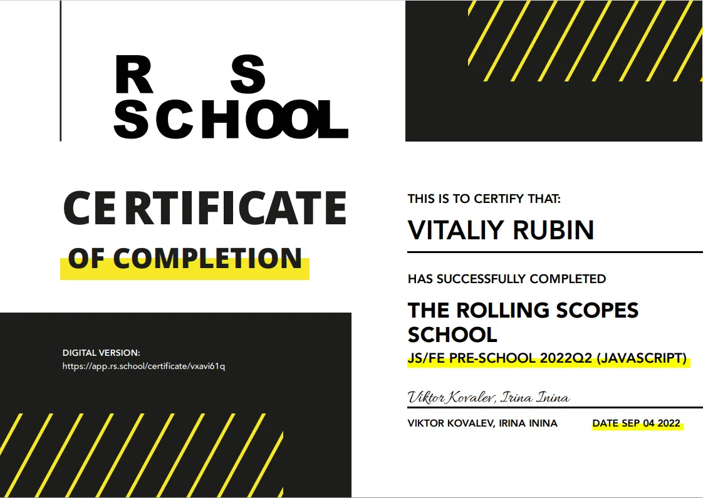

# __Vitaly Koiro__

### __Fullstack__ web developer

<hr>

## __Contact information__:
|||
|-|-|
|__Phone:__|[+375-333-935-935](tel:+375333935935 "call")|
|__E-mail:__|[dev@koiro.pro](mailto:dev@koiro.pro "write")|
|__Telegram:__|[@yuutacn](https://t.me/yuutacn "write")|
|__Website:__|[koiro.pro](https://koiro.pro "visit")|
|__Github:__|[@koirodev](https://github.com/koirodev "visit")|


## __Briefly About Myself__:
 
I am a Fullstack web developer and work for a company where I can use my knowledge and experience to build complete web applications. My knowledge of HTML, CSS, JavaScript, PHP and Laravel helps me build websites and applications with ease.

In my work, I strive to create user-friendly and functional web applications with flexible design and high performance. I use advanced tools and technologies to streamline the development process and improve the user experience.

In addition, I am confident that my experience and knowledge help me create high-quality, scalable and modern web applications that can meet the needs of users.

## __Skills and Proficiency__:

- HTML5, CSS3
- PUG, SASS, LESS
- JavaScript ES6, jQuery, TypeScript, PHP, Python, Node.js
- CMS (Wordpress, OpenCart, 1C Bitrix, Drupal, Joomla)
- React, Next.js, Redux, Laravel, Bootstrap, Vue
- Git (Gitlab, Github)
- Adobe PhotoShop, Adobe Illustrator, Figma, Avocode

## __Code example__:

>Hello World written in "C"

```c
#include <stdio.h>
int main()
{
  printf("Hello world\n");
  return 0;
}
```

## __Experience__:

>A few of my recent works.

- [__Hot huts__ (Click)](https://wp-hothuts.thedev.ru/ "visit")
  - CMS Wordpress
  - SEO optimization
  - Markup
- [__ИНТЕРСТРОЙПРОЕКТ__ (Click)](https://inter-str.ru/ "visit")
  - CMS Wordpress
  - SEO optimization
  - Markup

## __Courses__:

In 2022, he took a preparatory course.



## __Language__:

 - __English__ - A1
 - __Russian__ - Native

<style>
  img {
    max-height: 230px;
  }
</style>