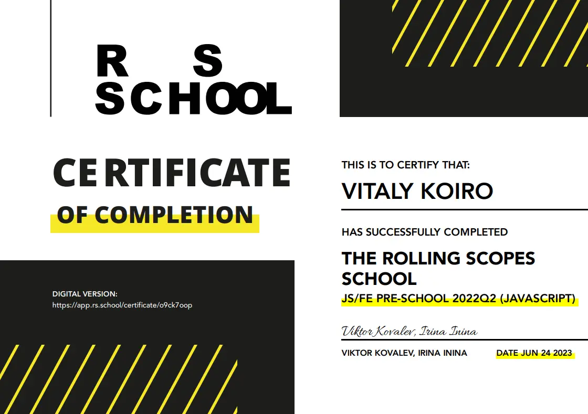

# **Vitaly Koiro**

### **Fullstack** web developer

<hr>

## **Contact information**:

|               |                                                       |
| ------------- | ----------------------------------------------------- |
| **Phone:**    | [+375-333-935-935](tel:+375333935935 "call")          |
| **E-mail:**   | [yuutacn@yandex.by](mailto:yuutacn@yandex.by "write") |
| **Telegram:** | [@koirodev](https://koirodev.t.me/ "write")           |
| **Github:**   | [@koirodev](https://github.com/koirodev "visit")      |


## **Briefly About Myself**:

Hello everyone. My name is Vitaly Koiro!

I am a web developer with over two years of commercial experience in creating, optimizing, and supporting websites. My strengths include both frontend and backend development, with a deep understanding of working with popular CMS platforms like WordPress, OpenCart, and MODx. I have successfully completed projects by adapting solutions to meet clients' unique requirements, creating and customizing themes and plugins, and integrating external services and APIs to enhance website functionality.

My technical skills include using the JavaScript library GreenSock (GSAP) to create animations, working with databases, and automating processes with Cron. I have implemented version control with Git, developed CI/CD processes, established coding standards, and improved team development workflows.

I am also passionate about teaching and mentoring, with experience in training new employees, conducting retrospectives, and organizing meetups for developers. My goal is to continuously improve development processes and implement modern technologies to create high-quality and secure web solutions.

I am a creative individual with the ability to find unconventional solutions and apply modern approaches in web development. Additionally, I have skills in working with Figma, enabling me to collaborate effectively with designers, make adjustments to layouts, and adapt designs to project needs, ensuring consistency and visual appeal in the final product.

Furthermore, I actively engage in identifying and mitigating vulnerabilities on websites, including SQLi, SSTI, CSRF, XSS, and others to ensure their security. My experience with Docker has allowed me to develop and configure environments for testing and deployment, and with Gulp, I have automated project build and optimization processes.

## **Skills and Proficiency**:

- HTML 5, CSS 3
- PUG, SASS, LESS
- JavaScript ES6, jQuery, Node.js, PHP, Python, C
- React, Next.js, Redux, Laravel, Bootstrap, Vue
- Git (Gitlab, Github)
- MySQL, PostgreSQL, MongoDB
- Docker, Gulp, Webpack, Babel, Cron, CI/CD
- Wordpress, OpenCart, Bitrix, MODx

## **Code example**:

>Hello World written in "C"

```c
#include <stdio.h>
int main()
{
  printf("Hello world\n");
  return 0;
}
```

## **Experience**:

>A few of my recent works.

- [**MKC** (Click)](https://marine-system.ru/ "visit")
  - - - -
- [**ЗГСО "ОРИОНИКС"** (Click)](https://zgso-orioniks.ru/ "visit")
  - - - -
- [**BM (отраслевые сайты для бизнеса)** (Click)](https://bmamonts.ru/ "visit")
    - [**Шаблон для ресторанов и кейтеринга** (Click)](https://dev33.bm-sites.ru/ "visit")
    - [**Шаблон для мебельных магазинов** (Click)](https://dev6.bm-sites.ru/ "visit")
  - - - -
- [**ORION (mobile agency)** (Click)](https://orionmobile.agency/ "visit")

## **Courses**:

In 2022, he took a preparatory course.



## **Language**:

 - **English** - B1
 - **Russian** - Native

<style>
  img {
    width: 100%;
    height: auto;
    border-radius: 20px;
  }
</style>
